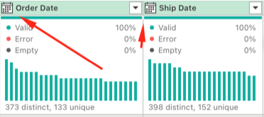

## Date Cleaning in Power Query (Mac)

This project demonstrates cleaning and standardizing date columns (`Order Date` and `Ship Date`) in Excel for Mac using Power Query.

---

### Before Cleaning

---

### Step 1 — Import CSV into Power Query

---

### Step 2 — Identify Date Columns

---

### Step 3 — Standardize Date Format

---

### Step 4 — Create Clean Date Column

---

### After Cleaning in Power Query

---

### After Cleaning in Excel
